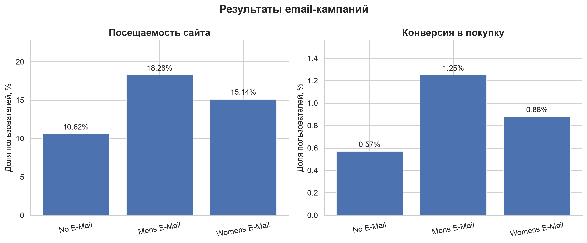
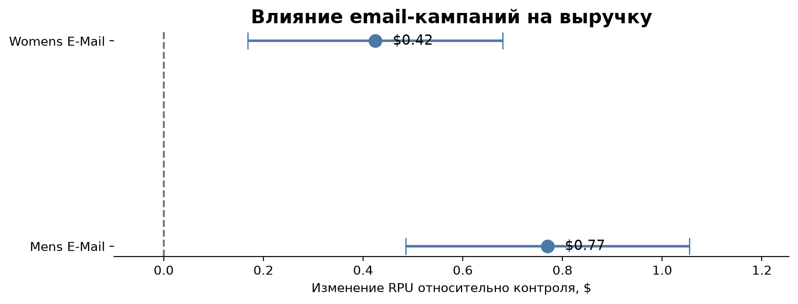

# Анализ эффективности email-кампаний

Проект посвящён анализу результатов A/B/n-теста двух email-кампаний.  
Цель исследования — определить, повышают ли email-рассылки посещаемость сайта, конверсию и выручку на пользователя по сравнению с отсутствием рассылки.

## Данные

В проекте используется открытый датасет Hillstrom Email Marketing, содержащий результаты маркетингового эксперимента примерно для 64 тысяч пользователей.

Пользователи были разделены на три группы:

- No E-Mail — контрольная группа, которая не получила письмо
- Mens E-Mail — пользователи, получившие письмо с мужской подборкой
- Womens E-Mail — пользователи, получившие письмо с женской подборкой

Основные признаки:

- segment — экспериментальная группа
- visit — посещение сайта после рассылки
- conversion — совершение покупки
- spend — сумма покупки
- recency — количество месяцев с момента последней покупки
- history — предыдущие расходы пользователя
- channel — канал, через который пользователь совершал покупки

Источник данных: [MineThatData E-Mail Analytics Challenge](https://blog.minethatdata.com/2008/03/minethatdata-e-mail-analytics-and-data.html).

## Задачи исследования

1. Проверить качество и корректность данных
2. Сравнить характеристики экспериментальных групп до воздействия
3. Рассчитать продуктовые и финансовые метрики
4. Проверить статистическую значимость различий
5. Сформулировать рекомендации на основе результатов эксперимента

## Метрики

В исследовании используются следующие метрики:

- Visit Rate — доля пользователей, посетивших сайт
- Conversion Rate — доля пользователей, совершивших покупку
- Revenue per User (RPU) — средняя выручка на одного пользователя

Основной бизнес-метрикой выбран RPU, поскольку она одновременно учитывает вероятность покупки и размер выручки.

## Использованные методы

- проверка пропусков и логической корректности данных
- анализ распределения пользователей по группам
- проверка баланса групп по исходным характеристикам
- z-тест для сравнения долей
- t-тест Уэлча для сравнения средней выручки на пользователя
- доверительные интервалы
- поправка Бонферрони при множественных сравнениях
- оценка потенциального бизнес-эффекта

## Результаты

| Группа | Visit Rate | Conversion Rate | RPU |
|---|---:|---:|---:|
| No E-Mail | 10,62% | 0,57% | $0,653 |
| Mens E-Mail | 18,28% | 1,25% | $1,423 |
| Womens E-Mail | 15,14% | 0,88% | $1,077 |

Обе email-кампании показали лучшие результаты по сравнению с контрольной группой.

### Mens E-Mail

По сравнению с контрольной группой:

- посещаемость увеличилась на 7,66 пп
- конверсия увеличилась на 0,68 пп
- RPU увеличился на $0,770 на пользователя
- 95%-й доверительный интервал прироста RPU: от $0,485 до $1,055

### Womens E-Mail

По сравнению с контрольной группой:

- посещаемость увеличилась на 4,52 пп
- конверсия увеличилась на 0,31 пп
- RPU увеличился на $0,424 на пользователя
- 95%-й доверительный интервал прироста RPU: от $0,169 до $0,680

Полученные различия статистически значимы после поправки на множественные сравнения.

## Визуализация результатов





## Бизнес-интерпретация

При масштабировании результатов на аудиторию в 100 000 пользователей ожидаемый дополнительный доход составляет:

| Кампания | Ожидаемый прирост выручки | 95%-й доверительный интервал |
|---|---:|---:|
| Mens E-Mail | $76 983 | от $48 514 до $105 451 |
| Womens E-Mail | $42 441 | от $16 896 до $67 987 |

Кампания Mens E-Mail показала наиболее высокие наблюдаемые значения всех основных метрик.

Прямое сравнение двух кампаний также показывает преимущество Mens E-Mail по RPU примерно на $0,345 на пользователя. Однако этот результат следует интерпретировать осторожно, поскольку прямое сравнение кампаний является дополнительным анализом.

## Вывод

Обе email-кампании положительно влияют на посещаемость сайта, конверсию и выручку на пользователя.

Если необходимо выбрать одну кампанию для общей аудитории, наиболее перспективным вариантом является Mens E-Mail, поскольку она показала максимальный прирост основной бизнес-метрики — RPU.

Перед полномасштабным запуском также необходимо учитывать стоимость рассылки, маржинальность продаж и возможные различия между реальной целевой аудиторией и участниками эксперимента.

## Структура проекта

```text
email-campaign-experiment/
├── data/
│   └── hillstrom.csv
├── notebooks/
│   └── experiment_analysis.ipynb
├── images/
│   ├── group_metrics.png
│   └── rpu_uplift_ci.png
├── README.md
├── requirements.txt
└── .gitignore
```

## Запуск проекта

1. Клонировать репозиторий.
2. Создать виртуальное окружение.
3. Установить зависимости.
4. Запустить Jupyter Notebook.

```bash
python3 -m venv .venv
source .venv/bin/activate
pip install -r requirements.txt
jupyter notebook
```

Ноутбук с исследованием: [experiment_analysis.ipynb](notebooks/experiment_analysis.ipynb)
